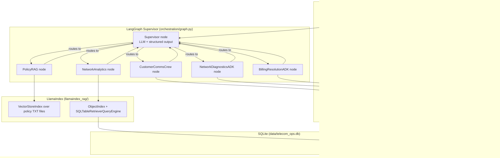

# How This Project Works — Architecture & Code Walkthrough

This document explains, in detail, what every part of the Prodapt AI
Operations Center does and how they fit together. It's organized so you can
either read it top-to-bottom for the full picture, or jump to the section
for whichever file you're looking at.

---

## 1. The problem, in one paragraph

Prodapt is a fictional telecom provider. Customer inquiries today require a
human to manually check the right one of four disconnected systems — policy
documents, an outage/tower database, live NOC dashboards, and a billing
system — then hand-write a reply. This project automates that: a single chat
box takes a plain-English inquiry, an AI **supervisor** decides which
specialist(s) it needs, those specialists pull real facts from real data
sources, and a final **communications crew** turns the findings into one
polished, accurate customer-facing reply — with every step visible in an
execution trace.

## 2. The five frameworks and why each one is used where it is

| Framework | Used for | Why this one |
|---|---|---|
| **LangGraph** | The supervisor and the overall control flow | It's built exactly for "LLM decides which node runs next, nodes share state, loop until done" — the core shape of this problem |
| **LlamaIndex** | Document RAG + semantic SQL (retrieval only) | Purpose-built retrieval/query-engine abstractions (`VectorStoreIndex`, `SQLTableRetrieverQueryEngine`) that don't require writing embedding or SQL-generation logic by hand |
| **Google ADK + A2A** | Network diagnostics & billing resolution, as independent services | Models the real-world requirement that NOC and Billing are separate teams who "can deploy/update agents independently" (spec §1.5) — A2A is Google's protocol for exactly that |
| **CrewAI** | The final customer-facing writer + reviewer | A two-role sequential crew (draft → review) is a natural fit for "write it, then have someone check tone/accuracy before it goes out" |
| **Streamlit** | The UI | Fast to build a real interactive front end with live status checks and a rich execution trace, without writing HTML/JS |

## 3. High-level architecture



Every worker returns control to the supervisor after it runs; the supervisor
decides the next step until it routes to `CustomerCommsCrew` (always last)
and then `FINISH`.

## 4. The database (`sql/`, `data/telecom_ops.db`)

`sql/01_schema.sql` creates 9 tables (provided, unmodified):

| Table | What it holds | Who touches it |
|---|---|---|
| `network_towers` | 10 towers: region, city, technology, status | Semantic SQL (read), Diagnostics ADK (read) |
| `network_outages` | Historical outage log (severity, duration, root cause) | Semantic SQL (read) |
| `tower_performance` | Time-series samples per tower (latency, packet loss, throughput, signal) | Semantic SQL (read), Diagnostics ADK (read) |
| `open_incidents` | Live NOC incident queue | Diagnostics ADK (read) |
| `customer_subscriptions` | Plans, fees, account types | Semantic SQL (read) |
| `billing_accounts` | Current balance per customer | Billing ADK (read + write) |
| `billing_charges` | Line items, duplicate flags, OPEN/PAID status | Billing ADK (read) |
| `billing_credits` | Applied/pending credits | Billing ADK (write on new credit) |
| `billing_disputes` | Dispute records | Reference only (not written by the tools) |

`init_db.py` runs both SQL scripts against a fresh `data/telecom_ops.db` and
prints row-count/spot-check verification. `common/db.py` is the *only* place
that opens a SQLite connection — a `get_connection()` context manager plus
three helpers (`fetch_all`, `fetch_one`, `execute_write`) that every ADK tool
calls. This is what satisfies the spec's "no in-memory dictionaries" rule:
nothing about a tower, incident, or balance is ever held in a Python
variable across calls — every tool function re-reads from SQLite each time
it runs.

## 5. LlamaIndex layer (`llamaindex_rag/`)

### 5.1 `document_rag.py` — PolicyRAG

1. `_configure_settings()` points LlamaIndex's global `Settings` at a local
   `HuggingFaceEmbedding` (`sentence-transformers/all-MiniLM-L6-v2`, runs on
   your machine, no API key needed) for embeddings, and, for answer
   synthesis, whichever LLM `config.get_llamaindex_llm()` resolves to based
   on `LLM_PROVIDER` — `llama_index.llms.anthropic.Anthropic` by default, or
   `llama_index.llms.openai.OpenAI` if `LLM_PROVIDER=openai`.

   > **Bug we found and fixed during testing:** `Settings.embed_model` has a
   > lazy-resolving *getter* — if you read it before assigning anything, it
   > tries to auto-default to an OpenAI embedding model and throws
   > `ImportError` (that package isn't installed, on purpose — we use the
   > local HuggingFace one). The fix was to assign unconditionally on first
   > use via a private `_settings_configured` flag, never reading the
   > property first to check it.

2. `_build_or_load_index()`: if `data/vector_index/` already has content, it
   loads the persisted index via `StorageContext.from_defaults(...)` +
   `load_index_from_storage(...)`. Otherwise it reads every `.txt` file in
   `data/documents/` with `SimpleDirectoryReader`, builds a
   `VectorStoreIndex`, and persists it — so the (slow, one-time) embedding
   step only happens once ever, not on every Streamlit rerun.

3. `get_query_engine()` calls `index.as_query_engine(similarity_top_k=4)` —
   this is a pure LlamaIndex retrieval/query engine, **not** a LlamaIndex
   agent, exactly as the spec requires.

4. `answer_policy_question(question)` is the one function everything else
   calls. It wraps `engine.query(...)` in a try/except so a missing
   `data/documents/` folder or an LLM failure comes back as a readable
   string instead of crashing the graph.

### 5.2 `sql_semantic_search.py` — NetworkAnalytics

This is the "ask a database question in English" half. Four tables are
exposed — `network_towers`, `network_outages`, `tower_performance`,
`customer_subscriptions` — deliberately **not** the billing tables (those
are ADK-only, never reachable by free-form generated SQL).

1. `_TABLE_CONTEXTS`: a hand-written, human-readable description per table
   (what it contains, what kind of question it answers). These strings are
   the whole trick behind "semantic" table selection.
2. `SQLTableNodeMapping` + `SQLTableSchema` wrap each table + its context
   string.
3. `ObjectIndex.from_objects(...)` embeds those context strings into a
   vector index, so a question like *"which towers have the highest packet
   loss"* semantically matches `tower_performance`'s description without any
   keyword matching.
4. `SQLTableRetrieverQueryEngine(sql_database, object_index.as_retriever
   (similarity_top_k=2))` does the rest: retrieve the 1–2 most relevant
   tables, have the LLM write real SQL against them, execute it against
   `data/telecom_ops.db`, and synthesize a natural-language answer from the
   result rows.

`answer_network_analytics_question(question)` is the public entry point,
same defensive try/except pattern as PolicyRAG.

## 6. Google ADK A2A services (`adk-services/`)

Both services follow the same shape: a `google.adk.agents.Agent` with a
system `instruction` and a list of plain Python **async functions** as
`tools` — ADK auto-generates each tool's JSON schema from its type hints and
docstring (we verified this directly: the published agent card correctly
lists all three tools per service with their full docstrings as
descriptions). The agent is wrapped with `to_a2a(root_agent, port=...)` into
a Starlette app, run with `uvicorn`.

### 6.1 Network Diagnostics (port 8001)

Three tools, each opening its own SQLite connection via `common/db.py`:

- **`check_tower_status(tower_id)`** — joins `network_towers` with the
  *single latest* `tower_performance` row for that tower (via a `MAX
  (recorded_at)` subquery, never an average) and any `open_incidents`.
- **`run_connectivity_diagnostics(tower_id, symptom)`** — same lookup, plus
  `_interpret_metrics()`, which applies the exact thresholds documented in
  both `sql/01_schema.sql`'s header comments and
  `data/documents/network_outage_procedures.txt`:

  | Metric | Normal | Elevated / Marginal | Severe / Poor |
  |---|---|---|---|
  | Signal strength | ≥ −90 dBm | −90 to −110 dBm (marginal) | < −110 dBm (poor) |
  | Packet loss | ≤ 1% | > 2% (elevated) | > 5% (severe); 100% = site down |
  | Latency (5G) | ≤ 40 ms | > 50 ms (elevated) | — |
  | 5G downlink | — | < 100 Mbps while OPERATIONAL = degraded | — |
  | 4G LTE downlink | — | < 10 Mbps = degraded (lower baseline than 5G) | — |

  It then produces a plain-English recommendation (dispatch to an open
  incident vs. "handset troubleshooting" vs. "all healthy").
- **`get_regional_network_summary(region)`** — aggregates tower counts by
  status and joins in that region's open incidents.

### 6.2 Billing Resolution (port 8002)

Three tools, implementing `billing_disputes_policy.txt` section 6 exactly:

- **`lookup_billing_account(customer_id)`** — the account row, all `OPEN`
  charges (this cycle's bill), a handful of recent `PAID` charges for
  context, and a computed `open_charges_total` that should equal
  `current_balance` (a self-check, not a business rule).
- **`check_duplicate_charges(customer_id)`** — one SQL query implements the
  spec's exact duplicate definition: a charge is a duplicate if
  `is_duplicate_flag = 1` **or** it shares `(description, billing_period)`
  with another `OPEN` charge for the same customer — and it excludes any
  charge that already has an `APPLIED` credit against it (so a resolved
  dispute is never re-credited). This was tested directly against the live
  database for 8 different customers and matched every expected outcome in
  the spec's practice-query table exactly.
- **`apply_billing_credit(customer_id, amount, reason, related_charge_id)`**
  — the core business rule:
  - amount ≤ **$50.00** → status `APPLIED`, balance reduced immediately
  - amount > **$50.00** → status `PENDING_APPROVAL`, balance **unchanged**
  - **Extra guard beyond the literal spec text, added because
    `billing_disputes_policy.txt` §6 explicitly calls for it**: the balance
    is never allowed to go below zero — if an `APPLIED` credit would
    overshoot, only enough is deducted to zero the balance out, and a note
    is appended to the tool's returned message explaining the clamp.

  Verified directly: a $65.99 credit on CUST-10002 comes back
  `PENDING_APPROVAL` with balance unchanged at $131.98; a $12.00 credit on
  CUST-10027 comes back `APPLIED` with the balance correctly reduced;
  exactly $50.00 on CUST-10128 is `APPLIED` (the boundary is inclusive).

## 7. LangGraph orchestration (`orchestration/`)

### 7.1 `state.py` — the shared state

```python
class AgentState(TypedDict):
    messages: Annotated[list[BaseMessage], operator.add]   # conversation history
    next: str                                              # supervisor's routing decision
    user_query: str                                        # original inquiry, unchanged
    agent_context: str                                     # accumulated worker findings
    execution_trace: Annotated[list[dict], operator.add]   # what the UI renders
    final_response: str                                    # CrewAI's polished text
    hops: int                                              # loop-prevention counter
```

`messages` and `execution_trace` use LangGraph's `operator.add` reducer, so
each node's partial return value is *appended* to the running list rather
than replacing it — the idiomatic LangGraph pattern for a supervisor loop.

### 7.2 `graph.py` — the supervisor and worker nodes

**The supervisor** (`supervisor_node`) is a chat model from
`config.get_chat_llm()` — `ChatAnthropic` by default, or `ChatOpenAI` if
`LLM_PROVIDER=openai` — bound to a Pydantic `RouteDecision` schema via
`.with_structured_output(...)` (both providers support this via tool
calling), so the
LLM's output is always a valid `{next: <one of 6 literal values>, reasoning:
str}` — no parsing brittle free text. Its system prompt (embedded in
`_SUPERVISOR_SYSTEM_PROMPT`) describes each worker's job, the keyword
signals that suggest it, and the routing rules from spec §9.6, then injects
the live `user_query`, `agent_context` so far, and the list of workers
already run this turn.

**On top of the LLM's decision, three hard rules are enforced in code** (not
left to the model to get right, since the spec is strict about them):

1. If the model says `FINISH` before `CustomerCommsCrew` has run, it's
   overridden to route to `CustomerCommsCrew` instead.
2. If `CustomerCommsCrew` has already run and the model somehow picks it
   again, it's overridden to `FINISH`.
3. If the model picks a worker that already ran this turn (other than
   `CustomerCommsCrew`), that's treated as "done gathering data" and routed
   to `CustomerCommsCrew`.

There's also a `MAX_WORKER_HOPS = 6` safety valve: if the loop somehow runs
that many worker hops without reaching `CustomerCommsCrew`, the supervisor
forces it, guaranteeing the graph can never spin forever.

**Each worker node** (`policy_rag_node`, `network_analytics_node`,
`network_diagnostics_adk_node`, `billing_resolution_adk_node`) calls its one
underlying function (from `llamaindex_rag/` or `adk_remote_client.py`) with
the original `user_query`, then calls the shared helper
`_record_worker_output(state, worker_name, output)`, which:

- Appends `[worker_name]\n{full output}` to `agent_context` (untruncated —
  this is what CrewAI reads).
- Appends `{"worker": worker_name, "output": output[:500]}` to
  `execution_trace` (truncated to 500 chars — this is what the UI shows, per
  spec §6.8.3).
- Increments `hops`.

`customer_comms_crew_node` does the same, plus sets `final_response` to the
crew's output.

**`build_graph()`** wires it together: `StateGraph(AgentState)`, one node per
worker plus `supervisor`, an edge from every worker back to `supervisor`, and
`add_conditional_edges("supervisor", lambda state: state["next"], {...})`
routing to the matching worker node or `END`.

**`run_telecom_assistant(user_query)`** is the single function the UI calls.
It builds the initial state, invokes the compiled graph with a
`recursion_limit=40` safety net, and returns a clean
`{final_response, execution_trace, agent_context}` dict — or
`{..., "error": str(exc)}` if anything throws, so the UI can show
`st.error` instead of crashing.

### 7.3 `adk_remote_client.py` — bridging LangGraph to the ADK services

This is the most mechanically involved file, because it's gluing two
different agent frameworks together over HTTP:

1. **`_service_reachable(agent_url)`** does a quick `httpx.get` on
   `/.well-known/agent-card.json` with a short timeout — used both here (to
   fail fast with a clear message) and in the Streamlit sidebar (to show
   Running/Not running).
2. **`_build_proxy_agent(name, agent_url, description)`** creates a
   `RemoteA2aAgent` pointed at the remote service's agent card URL, then
   wraps it in a *local* `google.adk.agents.Agent` whose only `sub_agents`
   entry is that remote agent, with an instruction telling it to
   unconditionally transfer every message to the sub-agent. This
   proxy-with-one-sub-agent pattern is what the spec's §6.5 asks for.
3. **`_invoke_agent(agent, message_text)`** creates an
   `InMemorySessionService` + `Runner`, sends one message as a
   `google.genai.types.Content`, and collects the final response text from
   the async event stream (`event.is_final_response()`).
4. **`_run_coro_blocking(coro_factory)`** lets LangGraph's synchronous node
   functions call this async machinery: normally just `asyncio.run(...)`,
   but if a loop is somehow already running (defensive, for unusual hosting
   setups) it falls back to running the coroutine in a dedicated thread.
5. **`diagnose_network_issue(query)`** and **`resolve_billing_issue(query)`**
   are the two public functions the LangGraph nodes call. If the target
   service isn't reachable, they return a plain string naming the exact
   command to start it (e.g. `python
   adk-services/network_diagnostics/agent.py`) instead of raising — so a
   demo where you forgot to start a service degrades gracefully instead of
   crashing the whole graph.

### 7.4 `crew_nodes.py` — the CrewAI customer communications crew

Two `crewai.Agent`s, both using `config.get_crewai_model_string()` as their
LLM — a LiteLLM-style `"anthropic/{ANTHROPIC_MODEL}"` string by default, or
`"openai/{OPENAI_MODEL}"` if `LLM_PROVIDER=openai`:

- **Communications Specialist** — drafts a customer-facing response using
  the original query + the full `agent_context` (every upstream worker's
  findings so far).
- **Quality Reviewer** — reviews the draft against those same findings for
  factual accuracy, tone, and policy compliance, and is explicitly
  instructed to catch the exact mistake that matters most here: claiming a
  `PENDING_APPROVAL` credit was already applied.

Wired as `Crew(agents=[...], tasks=[draft_task, review_task],
process=Process.sequential)`, with `review_task`'s `context=[draft_task]` so
it sees the draft as input. `generate_customer_response(user_query,
agent_context)` calls `crew.kickoff()` and returns the final text (or a
fallback string including the raw findings if the crew itself fails).

## 8. The Streamlit UI (`ui/app.py`)

**Sidebar** (spec §6.8.2):
- Four live status checks: DB file exists, vector index folder is non-empty,
  and an `httpx` health check against each ADK service's agent-card URL —
  all computed fresh on every page load, no caching, so they're always
  accurate.
- A warning box with the exact start commands if either ADK service is down.
- The framework map table.

**Main area** (spec §6.8.1/§6.8.3):
- Title + caption naming all four frameworks.
- A `st.text_area` for the inquiry (no sidebar sample-query buttons, per the
  spec's explicit instruction not to include them).
- A **Submit** button that calls `run_telecom_assistant(...)` inside a
  spinner, storing the result in `st.session_state.last_result` (so it
  survives Streamlit's automatic rerun-on-interaction behavior).
- The final response shown in `st.success(...)`.
- The **Agent Execution Trace** expander (`expanded=True` by default),
  looping over `execution_trace` and printing `Step N — {worker}` plus the
  (already-truncated) output for each, with a divider between steps. If the
  list is empty, it shows an explanatory `st.info` instead of a blank panel.
- A secondary "Raw agent_context (debug)" expander, collapsed by default —
  the optional enhancement from spec §6.8.6.
- `st.error(...)` if the graph returned an `error` key.

This file was tested with Streamlit's own `AppTest` harness (not just eyeballed) —
that testing caught one real bug: a bare ternary statement
(`st.success(...) if x else st.error(...)`) that Streamlit's "magic"
auto-display feature can't parse as a multi-line statement. It's fixed to a
plain `if/else` in the current code.

## 9. Putting it together — a full request, end to end

Using Scenario 4 (the billing dispute) as the concrete example:

1. Staff types the inquiry and clicks Submit → `ui/app.py` calls
   `run_telecom_assistant(query)`.
2. `graph.py` builds the initial `AgentState` and invokes the compiled
   LangGraph.
3. **Supervisor** reads the query, sees "charged twice" / a `CUST-` id, and
   its structured output routes to `BillingResolutionADK`.
4. **`billing_resolution_adk_node`** calls
   `adk_remote_client.resolve_billing_issue(query)`, which checks the
   service is up, builds a `RemoteA2aAgent` proxy, and sends the query over
   A2A/HTTP to the Billing Resolution service on port 8002.
5. Inside that service, the ADK agent's own LLM decides to call
   `lookup_billing_account`, then `check_duplicate_charges`, then
   `apply_billing_credit` — each one opening its own SQLite connection via
   `common/db.py`. The $65.99 duplicate charge is found, and because it's
   over $50, `billing_credits` gets a new `PENDING_APPROVAL` row while
   `billing_accounts.current_balance` stays at $131.98.
6. The service's agent returns a technical summary of what it found and did;
   this flows back over A2A to `adk_remote_client.py`, back to the LangGraph
   node, which appends it to `agent_context` and `execution_trace`, and
   returns control to the supervisor.
7. **Supervisor** sees `BillingResolutionADK` has already run and routes to
   `CustomerCommsCrew` (the hard-coded rule guarantees this regardless of
   what the LLM would have picked).
8. **`customer_comms_crew_node`** calls `crew_nodes.generate_customer_response`
   with the full `agent_context` — the Communications Specialist drafts a
   letter, the Quality Reviewer checks it says "submitted for approval," not
   "applied," and the final text becomes `final_response`.
9. **Supervisor** sees `CustomerCommsCrew` has run and returns `FINISH` →
   the graph reaches `END`.
10. `run_telecom_assistant` returns `{final_response, execution_trace,
    agent_context}` to the UI, which renders the polished letter and the
    2-step trace.

Every other scenario follows this same shape — 1 or 2 data/policy workers,
always finishing with `CustomerCommsCrew` — which is exactly what the
spec's sequence diagrams in section 9 describe.
